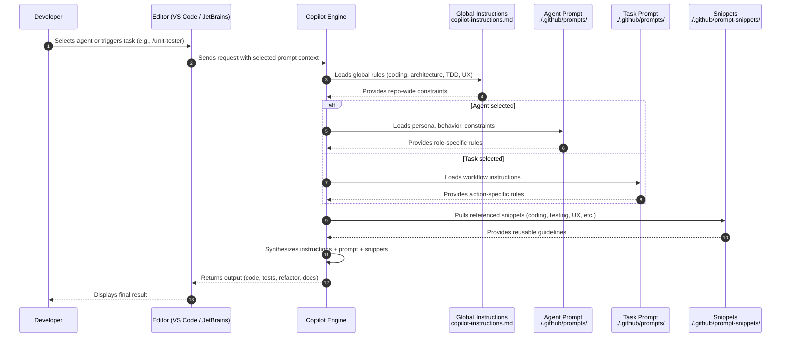

How to read this diagram
Developer

Triggers the workflow by selecting an agent or running a task.
Editor

Passes the selected prompt context to Copilot.
Copilot Engine

The orchestrator. It merges:

    global instructions

    agent or task rules

    referenced snippets

into a single behavioural context.
Global Instructions

Always loaded first. They define:

    coding style

    architecture

    TDD/testing expectations

    UX rules

    communication tone

Agent or Task

Only one is active per interaction:

    Agent → persona with long‑running behavior

    Task → one‑off workflow

Snippets

Reusable fragments pulled in as needed:

    coding standards

    testing guidelines

    Avalonia UX rules

    error handling

    commit messages

Output

Copilot synthesizes everything and returns deterministic, project‑aligned output.
Why this lifecycle matters

    It shows contributors where each file type fits in the decision chain.

    It clarifies why global instructions must stay concise and stable.

    It demonstrates how snippets prevent duplication and drift.

    It helps developers understand why agents behave consistently and tasks remain atomic.

    It reinforces the mental model that Copilot is not “guessing” — it’s following a layered instruction stack.
